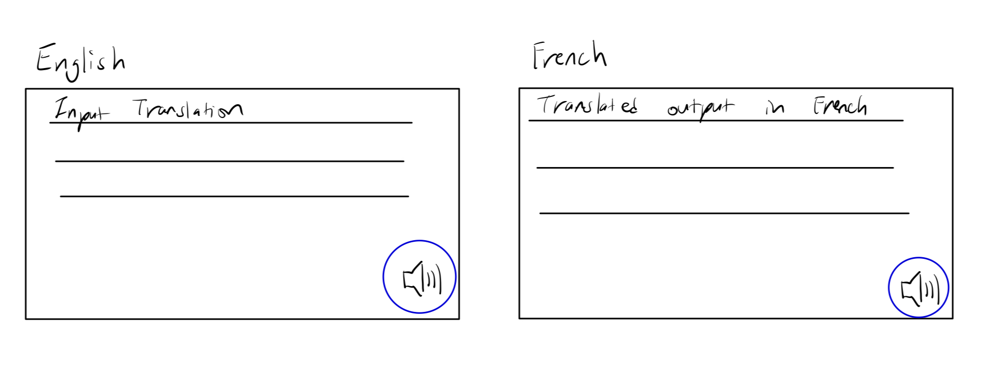

# The Translator
## Contributors and GitHub Usernames:
Julia Zaki / julia-zaki

Christina Huang / HChristinaH

Edan Wong / 903Edan

Manjun Zhu / Karrrrmen

Mingyu (Roy) Son / SonM12

## Table of Contents

1. [Summary of the project's purpose](#1-summary-of-the-projects-purpose)

2. [Features of the Software](#2-features-of-the-software)

3. [Installation Instructions](#3-installation-instructions)

4. [Usage guide](#4-usage-guide)

5. [License](#5-license)

6. [Feedback](#6-feedback)

7. [Contributions](#7-contributions)

## 1. Summary of the project's purpose

## 2. Features of the Software

## 3. Installation Instructions
This Translator Program requires installation of FreeTTS.
1. Download FreeTTS zip file from https://sourceforge.net/projects/freetts/files/ .
2. Extract downloaded zip file.
3. Browse to the following path.
   * freetts-1.2.2-bin/freetts-1.2/lib/
4. Run jsapi.exe file and install freeTTS
    * For Mac users, open terminal and browse to the extracted /lib folder.
    * chmod +x ./jsapi.sh and afterwards sh ./jsapi
5. Check jsapi.jar file is installed in the /lib folder.
6. Include /lib folder into the project.
   1. File -> project structure -> Project Settings -> Modules
   2. Click "+" icon, then select "1 JARs or Directories"
   3. Select the entire /lib folder.
   4. Apply then OK.

## 4. Usage guide

## 5. License
License is in the Project file.

## 6. Feedback
Users can give feedback via the Google forms link below.

We believe valid feedback is in the form of what was done well and what could be improved. Your feedback should target usability and simplicity of use, performance, presence of bugs and suggestions for new features. 
Feedback allows us to collect valuable insights from users to help us enhance the functionality, usability, and overall user experience of the software.

_Guidelines for what to expect when submitting your feedback:_

Providing your feedback: Submit your feedback while considering what counts as valid feedback for us (as mentioned above). Share your experiences and areas of improvements.
How we review your feedback: Upon submitting your feedback, we will review it thoroughly. Feedback regarding bugs and issues will be addressed immediately to ensure the software works correctly for its current users. Constructive feedback will be taken into consideration during future improvements of the software.
Updates: Suggestions and fixes may take time implement so make sure you look out for updates of the software as soon as they become available.
Stay engaged: Feel free to provide your feedback at any time. Your feedback helps us improve The Translator!!

<ins>Google form link:</ins>
https://forms.gle/XRTDruZFNydroKSE9

## 7. Contributions
To contribute to this project, open an issue or submit a merge request.

To fork this project on GitHub, click the fork button in the top right of the repository. 
Provide a brief description of the changes you intend on making to the project, and click the “Create Fork” button.

In your merge request, please summarize with clarity which files were modified and what files were added. 
Make sure to explain why these changes were necessary.

The protocols for reviewing contributions are as follows:
Your code should have clean coding style and code correctness, include tests and state test coverage, 
adhere to Clean Architecture and SOLID principles, and include javadocs that are accurate, clear, complete, 
easy to use, and up to date.

# Main View Sketch

# User Stories
# 1.
Julia is learning French and is using the translator to help her translate words from English to French or vice versa.
She uses the vocabulary feature where she can choose to store a certain word and its translation in a page called
“Vocabulary”. She can access the page at any time allowing her to revise or recall the words to advance her learning
process. The process is: Julia will click on the vocabulary page and manually input in both languages (view shown below)
[Julia Zaki’s User Story]
Potential API: Filebase

# 2.
Christina is studying abroad in Japan and sees a sign at a subway. She is not very familiar with Japanese.
She is in a rush and cannot easily type in the characters into her translation app so she uses the convert image
to text feature to take a picture and translate the sign.
[Christina Huang’s User Story]
API: OCR Space

# 3.
Edan is currently enrolled in a Korean learning course and several course materials are distributed in different
format of files. He wants those text in the files to be translated directly into his mother language so that he
does not have to copy and paste the text from the file into the translator. Therefore, he uses the
translate-file feature to translate the materials in an efficient way.
[Edan’s story]
Potential API: document translation API

# 4.
Karmen is taking a history class and needs to watch a documentary in a foreign language. 
To fully understand the documentary, she wants to translate its script into a language she’s comfortable with. 
Using the "Translate Video" feature, Karmen gains a deeper understanding of the documentary.
[Karmen Zhu’s User Story]
Potential API: YouTube

# 5.
Roy is studying French in order to prepare for his French proficiency test.
However, while studying the subject, he came across some words or sentences he does not know how to pronounce.
Using the speaker button located at the bottom right side of text boxes, Roy can listen to the inputted pronounciation.
[Roy Son's User Story]
Potential API: Google Translate

